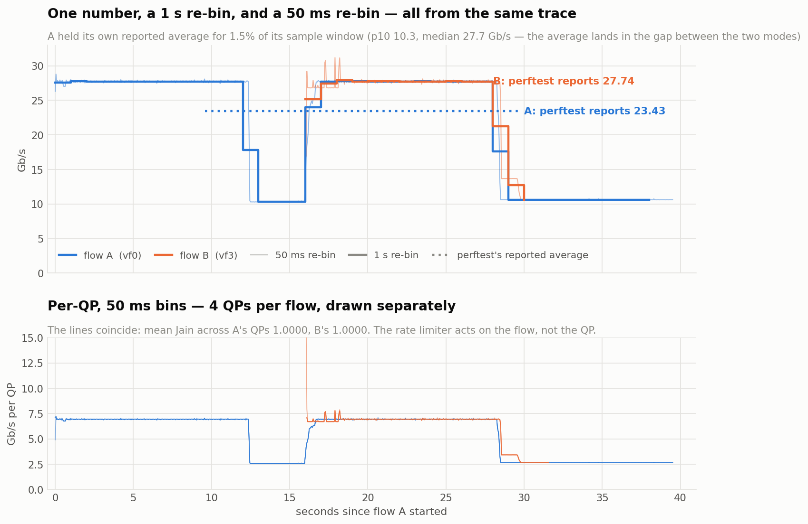

# Demo: the whole workflow, end to end

Run `./run_demo.sh` (~45 s), then `python3 plot_demo.py`. That is the demo.
This file explains what it does, what changes versus stock perftest, what
comes out, and how to read it.



---

## 1. The experiment

One RDMA flow, joined partway through by a second one aimed at the same
destination VF, then left alone again.

```
t=0    A: sgpu01 vf0 (mlx5_6) -> sgpu02 vf0 (10.1.0.2), 4 QPs, 65536 B, -D 40
t=16   B: sgpu01 vf3 (mlx5_9) -> sgpu02 vf0,            4 QPs, 65536 B, -D 16
t=32   B ends
t=40   A ends
```

`vf0` and `vf3` as the two sources deliberately: `vf1` and `vf2` hash to the
same PCC flowtag for every destination, so that pair would share one budget
for a reason unrelated to the demo.

Nothing in the hpft repos is read or written.

## 2. How the tool is used — the entire difference

Stock invocation, as the lab scripts use it today:

```sh
ib_write_bw -d mlx5_6 -p 18970 -s 65536 -q 4 --report_gbits -D 40 10.1.0.2
```

The demo's invocation:

```sh
ib_write_bw -d mlx5_6 -p 18970 -s 65536 -q 4 --report_gbits -D 40 \
            --report-per-qp --report-csv=results/A_trace.csv 10.1.0.2
#           ^^^^^^^^^^^^^^^^^^^^^^^^^^^^^^^^^^^^^^^^^^^^^^^^
```

**That is the whole difference.** Two flags. Everything else — the server
side, the ports, `-q`, `-D`, the report perftest prints at the end — is
unchanged, and the stock binary still works as the server.

Two more flags exist and are not used here:

- `--report-interval-us=<us>` switches from one record per completion to
  periodic snapshots. Only for message rates where per-CQE records will not
  fit in memory; it costs you the ability to re-bin offline.
- `--report-trace-mb=<MB>` sizes the buffer (default 256).

One gotcha the demo does not hit but you will: **`-D` is a negotiated
parameter.** The server's duration must equal the client's exactly, or the
handshake dies with `duration mismatch`. Nothing to do with this fork; it
just bites when you script two flows with different durations.

Optionally, alongside the run:

```sh
sudo tools/qpstat.py --dev mlx5_6/1 --pid $APID --interval-ms 100 \
                     --duration 37 --out results/A_qpstat.csv
```

Binds a dedicated hardware counter to each of that process's QPs, samples
the retransmit/error set, and unbinds on exit.

## 3. What comes out

```
results/
  A_trace.csv      1.60M events, 27 MB  per-QP completion trace
  B_trace.csv      0.73M events, 12 MB
  A_qpstat.csv     per-QP retransmit counters at 100 ms
  B_qpstat.csv
  A_perftest.log   perftest's own report, unchanged
  B_perftest.log
```

The trace header carries everything needed to interpret the body:

```
# perftest-hpft qptrace v1
# mode=event
# num_of_qps=4 msg_size=65536 cq_mod=1
# cpu_mhz=2100.000000 t0_tsc=... t0_realtime_ns=...
# margin_s=10 duration_s=40
# sample_start_us=9585132.914 sample_end_us=29585477.489
# qpn 0 1274
# qpn 1 1275
...
t_us,qp,msgs
```

Three of those lines matter more than they look:

- **`sample_start_us` / `sample_end_us`** are the window perftest's own
  average actually covers, stamped by `catch_alarm` in the same clock as
  the trace. Do not compute it from `margin`/`duration` — `t0` is stamped
  a few hundred ms after the alarm is armed (mostly inside `get_cpu_mhz`),
  and on this run that nominal window was off by **415 ms**, worth 1.6% of
  the reported average.
- **`qpn <index> <lqpn>`** is the join key to `qpstat.csv`.
- **`cq_mod`** is the quantum `msgs` advances in. It is 1 here because
  perftest auto-disables cq_mod above 8192 bytes; at smaller message sizes
  it silently reverts to 100 and you must pass `-Q 1`.

perftest also prints, at the end of the run:

```
qptrace: 1602698 events written to results/A_trace.csv
qptrace: 10122 completions/s/QP -> finest honest bin is ~988 us
```

That second line is the tool telling you its own resolution **at the rate
this run actually achieved** — which nothing can know beforehand.

## 4. How to analyse it

### Reconcile first

```sh
$ python3 ../tools/qptrace_parse.py results/A_trace.csv --bin-us 5000 \
      --sample-window --fairness
results/A_trace.csv: mode=event bins=4000 width=5000us span=20.000s qps=4
  qp   lqpn           Gb/s
  0    1274          5.857
  ...
  all               23.428
  jain across QPs: mean 0.9999  p05 0.9996  min 0.9897
```

perftest's own report for this run says **23.43 Gb/s**. The per-QP series
sums to **23.428** — 0.01%. Always do this before trusting a curve.

### Re-bin freely — that is the point of event mode

The bin width is not baked into the capture, so the same run answers
questions at different scales without going back to the lab:

```sh
python3 ../tools/qptrace_parse.py results/A_trace.csv --bin-us 200   ...
python3 ../tools/qptrace_parse.py results/A_trace.csv --bin-us 50000 ...
```

At 200 us it refuses to stay quiet:

```
WARNING: a 200 us bin holds 2.23 completions per QP. This is quantisation
noise, not a curve - use --bin-us 895 or coarser.
```

**A per-QP series is a curve only if each bin holds enough completions:**

```
completions per QP per bin = per-QP rate x bin / message size
```

At 64 KB messages and ~5.9 Gb/s per QP that is ~10 per ms — so ~1 ms is the
floor here. Shrinking `-s` to buy resolution needs `-Q 1` or it makes things
worse.

### Plot it

```sh
python3 plot_demo.py            # writes demo.png
```

## 5. Reading the figure

**Top panel — the reason this fork exists.** Three views of *the same
trace*: the single number perftest reports (dotted), a 1 s re-bin (the
finest the stock tool could ever report), and a 50 ms re-bin.

perftest reports **23.43 Gb/s** for flow A. Flow A was at 27.7 or at 10.3,
and **held its reported average for 1.5% of the sample window** (p10 10.3,
median 27.7). The dotted line sits in the empty gap between the two modes —
it is an arithmetic fact about a bimodal signal, not a rate anything ran at.

The 1 s re-bin does recover the shape. What it cannot do is place the
transitions: at 50 ms you can see A's step down completes inside one bin.

**Bottom panel — the dimension the stock tool does not have.** All 4 QPs of
each flow, drawn as separate lines. They coincide: **mean Jain 1.0000 at 50 ms
bins**, through both rate changes. The rate limiter acts on the
flow, not the QP. That is a finding, and it is only visible per-QP — but
note it also means for *this* executor the per-QP dimension is confirming a
negative. Where it earns its keep is when that stops being true.

**Retransmits.** `packet_seq_err` is **0 for both flows** in this run —
nothing was lost. The mechanism works — in `../results/twohost_incast_20260728` all four of
a joining flow's errors landed in one 100 ms sample 0.42 s after it joined,
while the incumbent recorded none — but on this near-lossless fabric it is
an event marker for a transient, not a rate to plot.

## 6. What this demo does not show

- **Small messages.** Everything here is 65536 B. At =< 8192 B, `cq_mod`
  reverts to 100 and the resolution story changes; pass `-Q 1`.
- **Binned mode.** `--report-interval-us` is exercised in the fork's tests
  but not here.
- **Many QPs.** 4 per flow. At 32+ the per-QP rate drops and the honest bin
  coarsens proportionally.
- **Multiple processes.** The lab's real experiments run one perftest per
  VF; merging several traces into one view needs their `t0_realtime_ns`
  headers and is not written yet.
- **Anything about HPFT.** Its agents were off for this run, though
  `doca_pcc` was live on the sender DPU — which is the most likely author of
  the rate steps you see.
